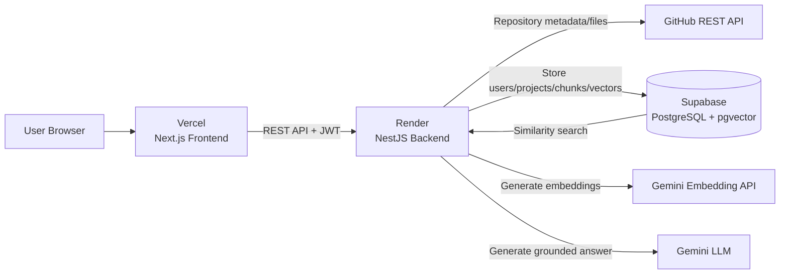
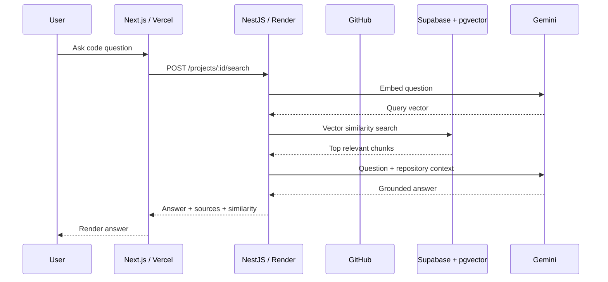

# repomind-ai

AI-powered GitHub repository explorer and code-search assistant built with Next.js, NestJS, Prisma, PostgreSQL, pgvector, LangChain, and Google Gemini.

## Live Demo

- Frontend: https://repomind-ai-five.vercel.app/login
- Backend: https://repomind-ai-wgm7.onrender.com
- Backend health check: https://repomind-ai-wgm7.onrender.com/health

> The Render backend uses a free instance, so the first request after inactivity can take longer while the service wakes up.

## Overview

RepoMind AI helps developers understand an unfamiliar GitHub repository by indexing source code and answering natural-language questions about the codebase.

The application follows a retrieval-augmented generation (RAG) pipeline:

1. A user adds a GitHub repository.
2. RepoMind fetches repository metadata and source files from GitHub.
3. Source code is split into searchable chunks.
4. Gemini generates an embedding for each chunk.
5. The chunks and embeddings are stored in Supabase PostgreSQL with pgvector.
6. A user asks a natural-language question.
7. The question is embedded using the same embedding model.
8. pgvector performs similarity search and returns the most relevant code chunks.
9. The retrieved code is passed to Gemini through the AI service.
10. RepoMind returns a grounded answer together with relevant source files and similarity scores.

## Key Features

- GitHub repository metadata lookup
- Repository content discovery
- Repository indexing
- Source-code chunking
- Gemini embeddings with pgvector similarity search
- Natural-language AI code search
- Grounded answers based only on retrieved repository context
- Relevant source-file attribution with similarity scores
- JWT-based authentication
- Password hashing with bcrypt
- User/project ownership checks
- Production deployment with Vercel, Render, and Supabase

## Tech Stack

| Layer | Technology |
|---|---|
| Frontend | Next.js 16, React 19, TypeScript |
| UI / Markdown | React Markdown, React Syntax Highlighter |
| State | Redux Toolkit, React Redux |
| Backend | NestJS 11, TypeScript |
| Authentication | JWT, Passport, bcrypt |
| ORM | Prisma 6 |
| Database | PostgreSQL |
| Vector search | pgvector |
| Embeddings | Google Gemini `gemini-embedding-001` |
| LLM | Google Gemini (`gemini-3.6-flash`) |
| GitHub integration | GitHub REST API |
| AI orchestration | LangChain |
| Frontend hosting | Vercel |
| Backend hosting | Render |
| Database hosting | Supabase |

## Architecture

See [`docs/ARCHITECTURE.md`](docs/ARCHITECTURE.md) for the detailed system design and request flows.

### High-level architecture



## RAG Flow



## Project Structure

```text
repomind-ai/
├── backend/
│   ├── src/
│   │   ├── modules/
│   │   │   ├── ai/
│   │   │   ├── auth/
│   │   │   ├── chunking/
│   │   │   ├── embedding/
│   │   │   ├── projects/
│   │   │   ├── repository/
│   │   │   ├── search/
│   │   │   └── users/
│   │   ├── prisma/
│   │   ├── app.controller.ts
│   │   ├── app.module.ts
│   │   └── main.ts
│   ├── prisma/
│   │   └── schema.prisma
│   ├── prisma.config.ts
│   ├── package.json
│   └── package-lock.json
│
├── frontend/
│   ├── app/
│   ├── components/
│   ├── services/
│   ├── store/
│   ├── public/
│   ├── package.json
│   └── package-lock.json
│
└── docs/
    └── ARCHITECTURE.md
```

## Database Design

Prisma manages the primary relational models:

```text
User
 └── Project
      └── CodeEmbedding
```

The application also uses a PostgreSQL table for vector search:

```text
CodeEmbedding.id
       │
       └──────────────► code_embedding_vectors.id
                         code_embedding_vectors.embedding
```

The vector table stores `vector(3072)` embeddings generated by `gemini-embedding-001`.

## Authentication Flow

```text
Login
  ↓
NestJS auth controller
  ↓
Find user by email
  ↓
bcrypt password comparison
  ↓
JWT signed with JWT_SECRET_KEY
  ↓
Frontend stores token
  ↓
Bearer token sent on protected requests
  ↓
JwtStrategy validates token
  ↓
Request proceeds to protected controller
```

## Local Development

### Prerequisites

- Node.js
- npm
- PostgreSQL-compatible database (Supabase is recommended for the deployed setup)
- Gemini API key
- GitHub token if required by the repository integration

### Backend

```bash
cd backend
npm install
npm run start:dev
```

### Frontend

```bash
cd frontend
npm install
npm run dev
```

Frontend:

```text
http://localhost:3000
```

Backend:

```text
http://localhost:3001
```

## Environment Variables

### Backend

Create `backend/.env` locally:

```env
DATABASE_URL=your_supabase_database_url
GEMINI_API_KEY=your_gemini_api_key
GOOGLE_API_KEY=your_gemini_api_key
GITHUB_TOKEN=your_github_token
JWT_SECRET_KEY=your_jwt_secret
FRONTEND_URL=http://localhost:3000
```

### Frontend

Create `frontend/.env.local` locally:

```env
NEXT_PUBLIC_API_URL=http://localhost:3001
```

For production, the frontend uses the Render backend URL:

```env
NEXT_PUBLIC_API_URL=https://repomind-ai-wgm7.onrender.com
```

Never commit real credentials.

## Database Setup

The deployed database uses Supabase PostgreSQL with the `vector` extension enabled.

Prisma-managed tables:

```bash
cd backend
npx prisma db push
npx prisma generate
```

The vector table is created separately because it is accessed with raw SQL:

```sql
CREATE TABLE IF NOT EXISTS code_embedding_vectors (
    id TEXT PRIMARY KEY,
    embedding vector(3072) NOT NULL
);
```

## Production Deployment

### Frontend — Vercel

- Repository: `Kousthub13/repomind-ai`
- Root Directory: `frontend`
- Framework: Next.js
- Environment variable:

```text
NEXT_PUBLIC_API_URL=https://repomind-ai-wgm7.onrender.com
```

### Backend — Render

- Repository: `Kousthub13/repomind-ai`
- Root Directory: `backend`
- Build command:

```text
npm ci && npm run build
```

- Start command:

```text
npm run start:prod
```

- Production start script:

```text
node dist/src/main
```

- Health endpoint:

```text
GET /health
```

### Database — Supabase

Supabase provides the PostgreSQL database and pgvector extension used by the RAG pipeline.

## Core API Routes

Representative backend routes include:

```text
POST /users/register
POST /auth/login
GET  /auth/profile

GET  /projects
POST /projects
GET  /projects/:id
DELETE /projects/:id
POST /projects/:id/index
POST /projects/:id/search

GET  /repository/info
POST /repository/content
POST /repository/readme
POST /repository/source-files
POST /repository/source-code
POST /repository/tree
POST /repository/contents

POST /embedding
POST /projects/:id/search
```

The exact route set should be verified against the current controllers when extending the API.

## AI Answering Behavior

The AI service is instructed to answer only from retrieved repository context.

When the retrieved context does not contain the requested information, the application returns a fallback such as:

```text
I couldn't find that information in the indexed repository.
```

This keeps the code-search experience grounded in the indexed codebase instead of encouraging unsupported answers.

## Production Verification

The deployed application has been verified through the following flow:

```text
Vercel frontend
    ↓
Render backend
    ↓
Supabase PostgreSQL + pgvector
    ↓
Gemini embeddings / LLM
    ↓
AI answer + relevant sources
```

A successful production search returns an AI answer together with source files and similarity scores.

## Future Improvements

- True re-indexing with cleanup/replacement of previous embeddings
- Repository change detection and incremental indexing
- Background indexing jobs for large repositories
- Streaming AI responses
- Better repository tree navigation
- Rate limiting and request quotas
- Automated CI/CD validation and tests
- Production observability and structured logging

## License

Add your preferred project license before publishing the repository as open source.

## Author

Kousthub Hothur
