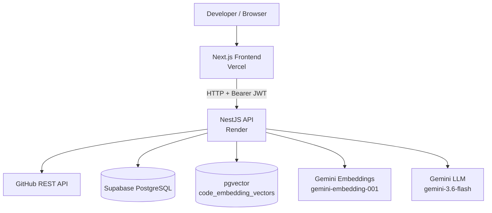
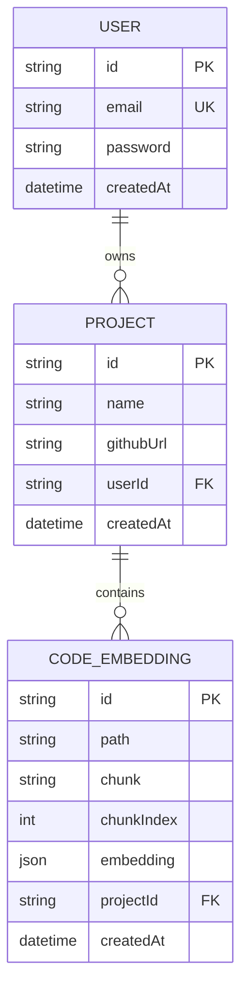
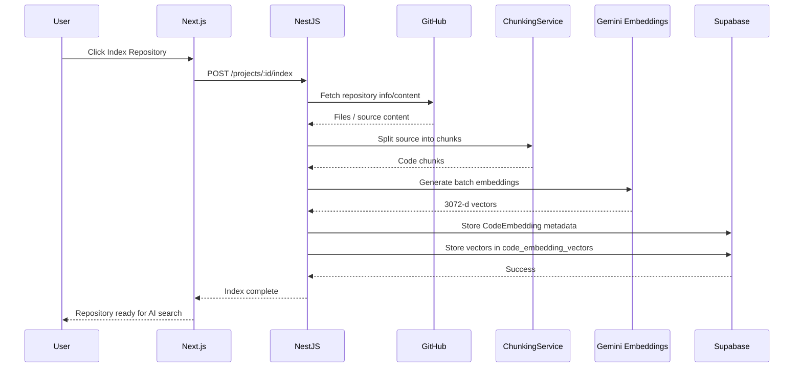
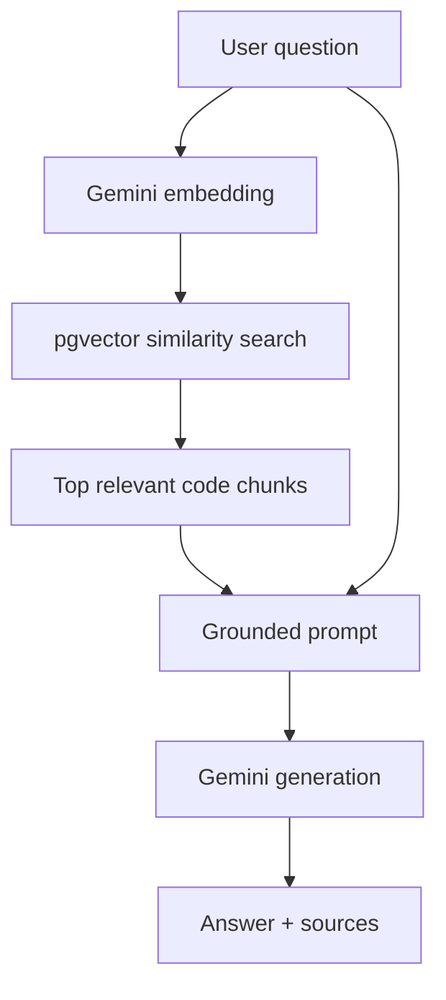
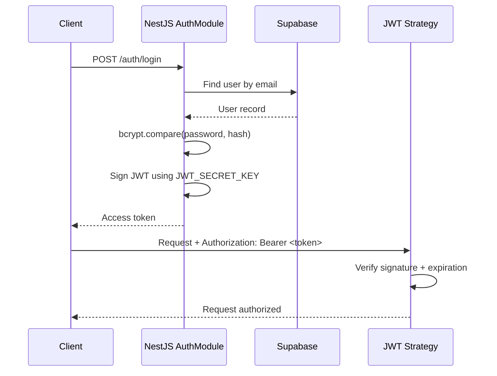
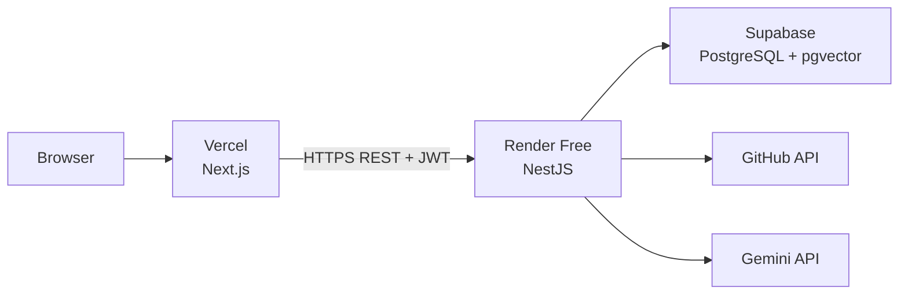

# RepoMind AI — System Architecture

## 1. Purpose

RepoMind AI is a repository intelligence application that lets a developer connect a GitHub repository, index its source code, and ask natural-language questions about the implementation.

The core architectural goal is to combine:

- a conventional REST API for application workflows,
- a relational database for users/projects/code chunks,
- vector search for semantic code retrieval,
- an LLM for grounded answer generation.

## 2. System Context



## 3. Logical Components

### Frontend

The Next.js application is responsible for the user-facing experience:

- authentication screens,
- project creation and project views,
- repository indexing controls,
- natural-language AI search,
- rendering Markdown/code-oriented AI answers,
- displaying source files and similarity scores.

The frontend does not hold backend secrets. It communicates with the NestJS API through `NEXT_PUBLIC_API_URL`.

### Backend

NestJS contains modular services for the core application logic:

```text
AppModule
├── AuthModule
├── UsersModule
├── ProjectsModule
├── RepositoryModule
├── ChunkingModule
├── EmbeddingModule
├── SearchModule
└── AiModule
```

Responsibilities are separated so that repository access, chunking, embeddings, search, authentication, and answer generation remain independently maintainable.

### Database Layer

Prisma manages the main relational models:

```text
User
 └── Project
      └── CodeEmbedding
```

The vector search table is maintained separately because the application uses PostgreSQL raw SQL and the pgvector type directly.

## 4. Database Model



Vector table:

```text
code_embedding_vectors
├── id TEXT PRIMARY KEY
└── embedding vector(3072)
```

The `id` matches `CodeEmbedding.id`, allowing the search query to join relational metadata to the vector representation.

## 5. Repository Indexing Flow



### Indexing responsibilities

1. Validate that the project belongs to the authenticated user.
2. Parse the GitHub repository URL into owner/repository information.
3. Fetch repository content through GitHub REST APIs.
4. Ignore unsuitable/non-source content according to repository filtering logic.
5. Split source files into manageable chunks.
6. Generate embeddings in batches.
7. Persist chunk metadata in `CodeEmbedding`.
8. Persist vectors in `code_embedding_vectors`.

## 6. Query / RAG Flow

The production search path is:



The backend search service currently:

1. verifies project ownership,
2. embeds the user query,
3. performs cosine-distance based vector search with pgvector,
4. filters results by a similarity threshold,
5. retrieves the top matching chunks,
6. builds a repository context block,
7. sends the question and context to the AI service,
8. returns the answer and source metadata.

The vector search is conceptually:

```sql
1 - (embedding <=> query_embedding)
```

where the result is treated as a similarity score and used for ranking/filtering.

## 7. Grounding Strategy

The AI service is deliberately constrained to repository context.

Conceptually:

```text
System instruction
        +
Retrieved repository chunks
        +
User question
        ↓
Gemini generation
        ↓
Grounded answer
```

If the retrieved context does not support the question, the application uses a fallback response instead of fabricating repository facts.

This behavior was verified in production with an unrelated question that returned the indexed-repository fallback, while repository-specific questions returned relevant source-backed answers.

## 8. Authentication Architecture



Passwords are stored as bcrypt hashes rather than plaintext.

JWT verification uses the same secret configured by `JWT_SECRET_KEY` in the backend environment.

## 9. Authorization Model

Projects are associated with a user:

```text
User 1 ─────── N Project
```

Protected project operations validate both:

```text
project.id
project.userId === authenticatedUserId
```

This prevents a logged-in user from querying or modifying another user's project by ID.

## 10. Deployment Architecture



### Vercel

Hosts the Next.js frontend from the repository's `frontend` directory.

Production API base URL:

```text
NEXT_PUBLIC_API_URL=https://repomind-ai-wgm7.onrender.com
```

### Render

Hosts the NestJS backend from the repository's `backend` directory.

Build:

```text
npm ci && npm run build
```

Start:

```text
npm run start:prod
```

The production entry point resolves to:

```text
node dist/src/main
```

The backend exposes:

```text
GET /health
```

### Supabase

Provides PostgreSQL and the pgvector extension. Prisma creates the relational schema, while the vector table is managed using SQL.

## 11. Environment Boundary

### Browser-visible

Only variables prefixed with `NEXT_PUBLIC_` should be exposed to the browser. For this project:

```text
NEXT_PUBLIC_API_URL
```

### Server-only

These remain on the backend:

```text
DATABASE_URL
GEMINI_API_KEY
GOOGLE_API_KEY
GITHUB_TOKEN
JWT_SECRET_KEY
FRONTEND_URL
```

This boundary prevents database credentials and API secrets from being bundled into the frontend.

## 12. Error Handling

The backend returns HTTP errors for cases such as:

- project not found,
- unauthorized requests,
- invalid credentials,
- upstream GitHub failures,
- embedding/AI failures.

The frontend API layer converts non-2xx responses into JavaScript `Error` objects, while page-level handlers display user-facing error states.

For AI search specifically, an empty retrieval set returns a safe repository-context fallback rather than sending unsupported context to the LLM.

## 13. Production Verification

The deployment was validated in this order:

```text
1. Supabase PostgreSQL connection
2. Prisma schema push
3. pgvector extension
4. code_embedding_vectors creation
5. Production indexing
6. Production vector retrieval
7. Production AI generation
8. Vercel frontend
9. Render backend
10. End-to-end browser search
```

Verified production path:

```text
https://repomind-ai-five.vercel.app
        ↓
https://repomind-ai-wgm7.onrender.com
        ↓
Supabase PostgreSQL + pgvector
        ↓
Gemini
```

## 14. Current Trade-offs

### Free Render instance

The backend can sleep when idle, so the first request after inactivity can be slower.

### Manual indexing

Indexing is currently user-triggered. Automatic webhook-based incremental indexing is not part of the current version.

### Vector table outside Prisma model

`code_embedding_vectors` is maintained as a custom PostgreSQL table because pgvector is accessed directly through SQL.

### Fixed top-k retrieval

Search currently retrieves a small top-k set of chunks and applies a similarity threshold. Larger repositories may benefit from more advanced hybrid retrieval, reranking, or hierarchical context selection.

## 15. Future Architecture Improvements

```text
Current
GitHub → Chunk → Embed → pgvector → Gemini

Possible evolution
GitHub webhook
     ↓
Incremental index job
     ↓
Chunk diffing
     ↓
Batch embeddings
     ↓
pgvector
     ↓
Hybrid retrieval / reranking
     ↓
Streaming Gemini answer
```

Potential next architectural improvements:

- background job queue for indexing,
- incremental re-indexing,
- lexical + vector hybrid search,
- reranking before generation,
- streaming responses,
- repository version tracking,
- rate limiting and quotas,
- structured application logging,
- automated tests in CI.
